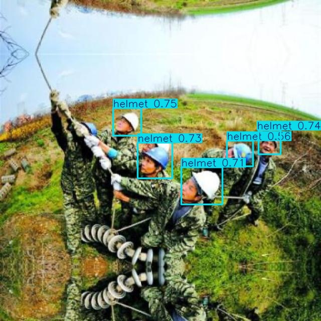
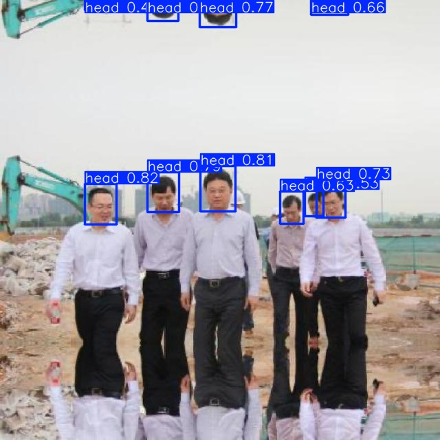

# HELMET-DETECTION-YOLOV8


This is an enhanced helmet and vest detection system built on **YOLOv8**, upgraded with **SPD-Conv layers** and **EMA Attention** to improve feature extraction, spatial awareness, and detection robustness.  
This model is designed for construction-site safety monitoring to ensure workers comply with PPE (Personal Protective Equipment) norms.

---

## 🚀 Detection Results

### 🖼️ Image-Based Detection Demo

The model accurately detects **helmets** and **vests** across diverse construction-site environments using the improved YOLOv8 + SPD-EMA architecture.

**SAMPLE IMAGES**


<p align="center">
  
  
</p>


🔗 **[Google Drive – Full Results Folder](https://drive.google.com/drive/folders/1mN1S-gdZScozvR29-8DpZ5WK6loHT276?usp=drive_link)**  
Contains **500+ output images** generated from the model, showcasing full inference results.

---

## ⚙️ Model Architecture Enhancements

HelmetGuard improves YOLOv8 by integrating:

### 🔷 SPD-Conv (Space–Depth Convolution)
- Enhances multi-scale feature extraction  
- Improves spatial–channel fusion  
- Strengthens small-object detection (helmets)

### 🔶 EMA Attention (Exponential Moving Average Attention)
- Stabilizes feature activation  
- Reduces noise sensitivity  
- Helps model focus on crucial regions (helmet + vest zones)

Together, SPD-Conv + EMA significantly boost accuracy and feature consistency compared to baseline YOLOv8.

The idea/concept has been explained in detail in the report associated in this github repository.

---

## 📈 Training Performance


**Final Reported Metrics:**

| Metric | Value | Meaning |
|-------|-------|---------|
| 🎯 **Precision** | 91.6% | Correct positive detections |
| 🔎 **Recall** | 90.5% | Ability to find all objects |
| 🏆 **mAP@0.5** | 89.3% | Overall detection performance |
| 📊 **mAP@0.5:0.95** | 76.7% | Accuracy across IoU thresholds |

This confirms the model’s strong capability for real-world construction-site safety monitoring.

---

## 🛠️ Installation Guide

```bash
# Clone this repository
git clone https://github.com/yourusername/helmet-guard.git
cd helmet-guard

# Create and activate virtual environment
python -m venv .venv
source .venv/bin/activate     # Windows: .venv\Scripts\activate

# Install dependencies
pip install -r requirements.txt
